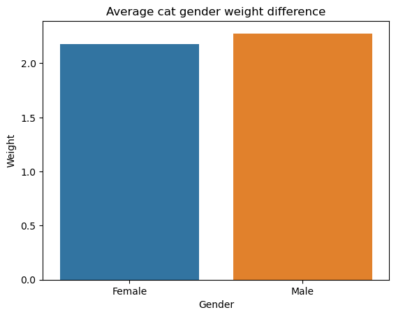

## Dataset
[Cats Dataset] https://www.kaggle.com/datasets/waqi786/cats-dataset

## Why did I chose this dataset?

[Placeholder for answer]

## Progress
- [x] Picked dataset
- [x] Defined 10 questions
- [x] Answered 10 questions using Pandas
- [x] Added at least one data visualization (using Matplotlib and/or Seaborn) to each single question
- [ ] Prepared presentation slides to present at graduation

## Questions
- [x] Question 1: What is the average weight of cats?
  - Answer: 6 kg
  - Visualization: ![Q1 Visualization]

- [x] Question 2: What is the average weight of every cat breed?
  - Answer: Abyssinian            5.0
            American Shorthair    6.0
            Balinese              5.0
            Bengal                5.0
            Birman                6.0
            British Shorthair     6.0
            Burmese               5.0
            Chartreux             5.0
            Cornish Rex           6.0
            Devon Rex             5.0
            Egyptian Mau          6.0
            Exotic Shorthair      6.0
            Himalayan             7.0
            Maine Coon            6.0
            Manx                  6.0
            Munchkin              6.0
            Norwegian Forest      5.0
            Ocicat                6.0
            Oriental              5.0
            Persian               5.0
            Ragdoll               5.0
            Russian Blue          5.0
            Savannah              5.0
            Scottish Fold         6.0
            Siamese               6.0
            Siberian              6.0
            Singapura             6.0
            Sphynx                5.5
            Tonkinese             5.0
            Turkish Angora        6.0
  - Visualization: ![Q2 Visualization]

- [x] Question 3: What is the average difference in weight between genders?
  - Answer: Female    2.175279
            Male      2.276602
  - Visualization: ![Q3 Visualization]

- [x] Question 4: What is the oldest age for every cat breed?
  - Answer: Abyssinian            19
            American Shorthair    19
            Balinese              18
            Bengal                19
            Birman                19
            British Shorthair     19
            Burmese               19
            Chartreux             19
            Cornish Rex           19
            Devon Rex             19
            Egyptian Mau          19
            Exotic Shorthair      19
            Himalayan             18
            Maine Coon            19
            Manx                  19
            Munchkin              19
            Norwegian Forest      19
            Ocicat                19
            Oriental              18
            Persian               19
            Ragdoll               19
            Russian Blue          19
            Savannah              19
            Scottish Fold         19
            Siamese               19
            Siberian              19
            Singapura             17
            Sphynx                19
            Tonkinese             19
            Turkish Angora        19
  - Visualization: ![Q4 Visualization][alt text](image-10.png)

- [x] Question 5: The most common color of a cat?
  - Answer: Tricolor
  - Visualization: ![Q5 Visualization]

- [x] Question 6: The most sourced breed of cat?
  - Answer: Ragdoll
  - Visualization: ![Q6 Visualization]

- [x] Question 7: Does the average weight go up with age?
  - Answer: No, The Average weight stays at around 6 or 5.5 consistently despite age
  1     5.0
  2     6.0
  3     5.0
  4     6.0
  5     6.0
  6     6.0
  7     6.0
  8     5.0
  9     6.0
  10    5.0
  11    5.0
  12    6.0
  13    5.0
  14    5.5
  15    6.0
  16    5.5
  17    5.0
  18    6.0
  19    6.0
  - Visualization: ![Q7 Visualization]

- [x] Question 8: Do Bicolor and Tricolor cats weigh more on average?
  - Answer: No, Bicolor and Tricolor cats both weight around 5 kgs on average, which is below average compared to other colored cats.

  - Visualization: ![Q8 Visualization]

- [x] Question 9: What breed do Bicolor/Tricolor cats belong to?
  - Answer: Bicolor - American Shorthair (9 Instances), Tricolor - Scottish Fold (6 Instances)
  - Visualization: ![Q9 Visualization]

- [x] Question 10: What breed has the most unicolor cats?
  - Answer: Ragdoll
  - Visualization: ![Q10 Visualization]